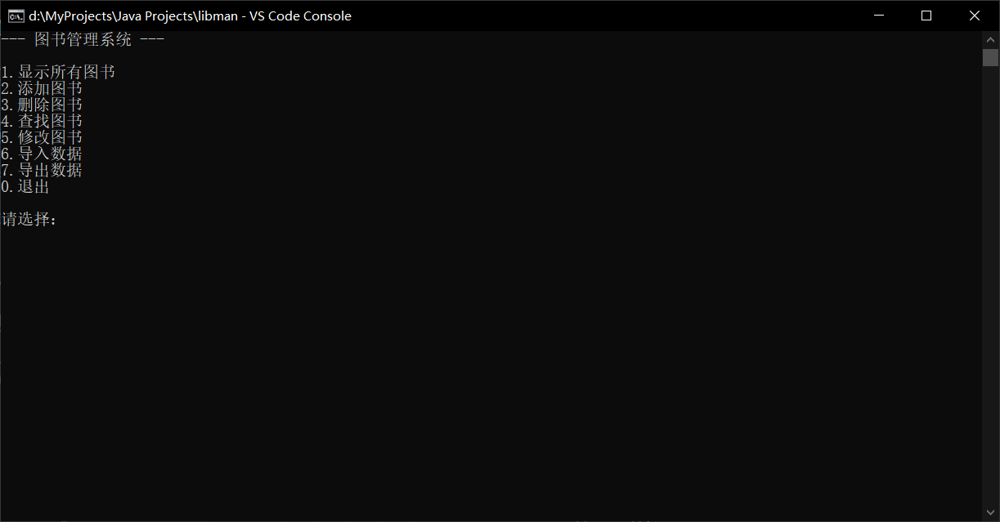
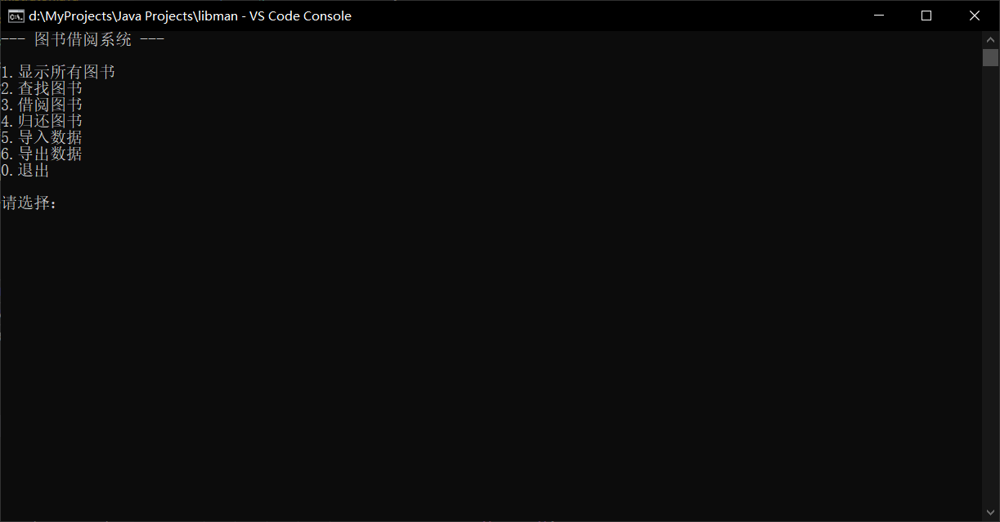

# Java 图书馆管理系统

### 概述
- - - - - - - - - - - -
本项目是计科的一项实践作业，使用Java语言开发，实现了**图书管理系统**和**图书借阅系统**两个子系统，主要完成了以下功能：

+ 显示所有图书
+ 添加图书
+ 删除图书
+ 查找图书
+ 修改图书
+ 导入数据
+ 导出数据
+ 借阅图书
+ 归还图书

### 使用说明
- - - - - - - - - - - -
##### 启动界面


启动主程序（Main.java）后会看到上面的界面，输入数字，选择你想要进入的子系统。

##### 图书管理系统


> 初始时图书列表为空，应当先**添加图书**或**导入数据**。
1. 显示所有图书
这里可以看到所有添加的图书种类，按<kbd>1</kbd>和<kbd>2</kbd>翻页。
2. 添加图书
输入图书的属性来添加图书类型，编号重复或者数据类型不匹配会添加失败。注意，输入**空格**会引起错误，因为空格会分隔输入。
3. 删除图书
输入图书的编号来删除图书类型，找到指定编号的图书后会显示图书信息，并询问是否删除。
4. 查找图书
根据图书的属性查找图书类型，如果属性值是数值则查找属性值为指定范围的图书，如果是字符串则显示属性值中包含此字符串的图书。可以使用<kbd>1</kbd>和<kbd>2</kbd>键翻页。
5. 修改图书
输入图书的编号来修改图书的属性，会显示修改前后图书的属性值。
6. 导入数据
从文件中导入图书数据，文件必须是由**导出数据**选项所创建的。文件路径可以是相对或绝对路径，文件扩展名随意。
7. 导出数据
导出图书数据到文件。

##### 图书借阅系统


> 初始时图书列表为空，必须先**导入数据**。借阅或归还图书后必须**导出数据**，否则所做的更改不会生效。
1. 显示所有图书
（同上）
2. 查找图书
（同上）
3. 借阅图书
输入图书的编号来借阅图书，如果库存数量为0，则借阅失败。
4. 归还图书
输入图书的编号来归还图书。
5. 导入数据
（同上）
6. 导出数据
（同上）

### 开发环境
- - - - - - - - - - - -
* JDK 17.0.2
* VSCode 1.77.3

### 项目介绍
- - - - - - - - - - - -
本项目共包含6个类，各类之间的关系如下图（部分属性和方法略）：

完成各功能的方法之间的调用关系如图：

各类主要包含的属性和方法：
Book类
```Java
    private int number;
    private String name;
    private String author;
    private String category;
    private int count;
    public boolean setAll();
```