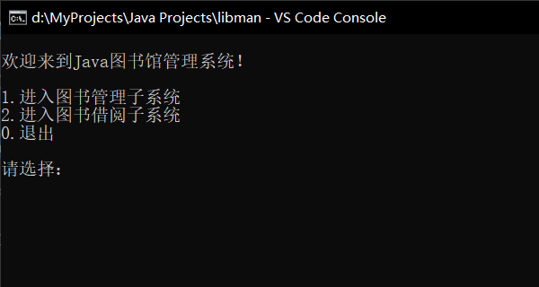
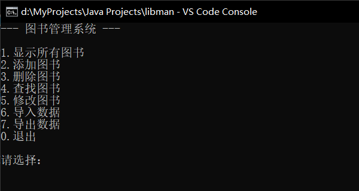
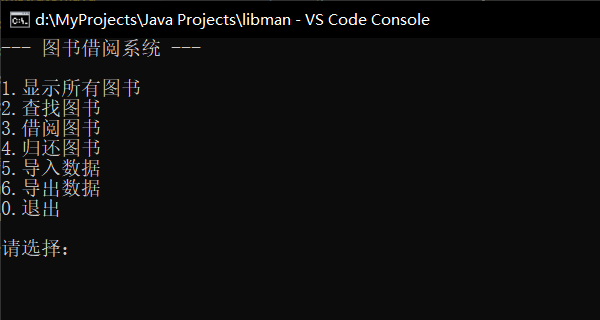

# Java 图书馆管理系统

### 简介
- - - - - - - - - - - -

本项目是计科的一项实践作业，使用Java语言开发，实现了**图书管理系统**和**图书借阅系统**两个子系统。主要完成了以下功能：

+ 显示所有图书
+ 添加图书
+ 删除图书
+ 查找图书
+ 修改图书
+ 导入数据
+ 导出数据
+ 借阅图书
+ 归还图书

本项目的 [github 地址](https://github.com/I0me0I/library-manager-java)

### 使用说明
- - - - - - - - - - - -

##### 启动界面

启动主程序（Main.java）后会看到上面的界面，输入数字，选择你想要进入的子系统。

##### 图书管理系统

> 注意：初始时图书列表为空，应当先**添加图书**或**导入数据**。

1. 显示所有图书  
这里可以看到所有添加的图书种类，按<kbd>1</kbd>和<kbd>2</kbd>翻页。

2. 添加图书  
输入图书的属性来添加图书类型，编号重复或者数据类型不匹配会添加失败。注意，输入**空格**会引起错误，因为空格会分隔输入。

3. 删除图书  
输入图书的编号来删除图书类型，找到指定编号的图书后会显示图书信息，并询问是否删除。

4. 查找图书  
根据图书的属性查找图书类型，如果属性值是数值则查找属性值为指定范围的图书，如果是字符串则显示属性值中包含此字符串的图书。可以使用<kbd>1</kbd>和<kbd>2</kbd>键翻页。

5. 修改图书  
输入图书的编号来修改图书的属性，会显示修改前后图书的属性值。

6. 导入数据  
从文件中导入图书数据，文件必须是由**导出数据**选项所创建的。文件路径可以是相对或绝对路径，文件扩展名随意。

7. 导出数据  
导出图书数据到文件。

##### 图书借阅系统

> 注意：初始时图书列表为空，必须先**导入数据**。借阅或归还图书后必须**导出数据**，否则所做的更改不会生效。

1. 显示所有图书  
（同上）

2. 查找图书  
（同上）

3. 借阅图书  
输入图书的编号来借阅图书，如果库存数量为0，则借阅失败。

4. 归还图书  
输入图书的编号来归还图书。

5. 导入数据  
（同上）

6. 导出数据  
（同上）

### 开发环境
- - - - - - - - - - - -

* JDK 17.0.2
* VSCode 1.77.3

### 项目内容
- - - - - - - - - - - -

##### 文件列表

该项目的文件列表如下：

    code                    // 项目的 java 代码
    |--Administrator.java
    |--Book.java
    |--Bookshelf.java
    |--GeneralUser.java
    |--Main.java
    |--User.java
    diagram                 // 用 draw.io 编写的图的源文件
    |--classes.drawio
    |--functions.drawio
    img                     // 图片
    |--bookborrow.png
    |--bookman.png
    |--bootmenu.png
    |--classes.svg
    |--functions.svg
    |--example.gif
    readme.md               // 本文档的 markdown 源文件
    报告.html               // 本文档的 html 版本
    报告.pdf                // 本文档的 pdf 版本

其中`code`文件夹包含了本项目所有的Java源文件，`Main.java`文件中的`main()`方法为程序的入口点。  
项目报告使用 markdown 编写，为了便于老师阅读，已转换为 html 和 pdf 格式（即`报告.html`和`报告.pdf`），建议阅读 html 版本。  
下面的类图及功能框图使用 draw.io 编写，并转换为了 svg 格式  

##### 类图

本项目共包含6个类，各类之间的关系如下图（部分属性和方法略）：

##### 功能框图

完成各功能的方法之间的调用关系如图：

### 使用示例

> 注意：如果本文档为 PDF 格式，下面的 GIF 图片无法正确显示

